# Tech Blog

## Description

This full-stack web app serves the all-important purpose of letting experienced developers and students/novices interact with each other by making posts and commenting on them. It has an intuitive design, packed with functionality (See the 'Usage' section) and follows the well-known template of the CMS-style blog. The homepage is designed to be read-only for non-logged-in users
but by starting a session, either through the login or signup forms, you can unpack many features that will allow to search posts by users/bloggers, add your own posts, comment on them and edit your own posts and comments by either deleting or updating them. Once you are done, you can safely logout knowing that the content you created is safely inside a MySQL database.

For its author, the challenge was an instructive way to :

1. Keep practicing modularization as a way to implement separation of concerns. In this case we are following the MVC (Model-View-Controller) and we are coding both the front- and the back-end of the application.

2. Continue learning about the connection between different methods of request (get, post, put, and delete) using the Fetch API on the front-end and the different routes defined on the back-end. The increased number of routes (sometimes up to three for the same endpoint) vastly increases the difficulty of connecting those two sides of the coin.

3. Keep using Sequelize models to make CRUD operations on the database.

4. The use of templating engines, in particular "handlebars", for producing views on the front-end instead of utilizing regular html documents. It helps somewhat to adhere to the DRY (Dont Repeat Yourself) coding paradigm and to clearly separate the logic part (by means of built-in and custom helpers, and the linked script files) from the rest of it.

5. The use of validators and methods of encryption for information submitted in login and signup forms and the creation of sessions with metadata stored in cookies whose duration you can stipulate.

## Table of Contents

- [Installation](#installation)
- [Usage](#usage)
- [Credits](#credits)
- [License](#license)

## Installation

N/A: The full stack application is actually a website deployed to Heroku. See "Credits" section for more information. We built the app using the officially supported Heroku Node.js buildpack and the remote MySQL database ("tech_db") was created using the JawsDB add-on. The db was seeded by running the command "heroku run node  seeds/index.js" to populate the tables from the Heroku CLI.

## Usage

Disclaimer: Screenshots present the website as rendered on the Google Chrome Version 116.0.5845.188 (Official Build) (64-bit), run in a Windows 11 Home Version 22H2 environment.

1.By navigating to the Heroku URL <https://a-better-tech-blog-23e1fba161e5.herokuapp.com>, the user will be presented with all available blogposts:

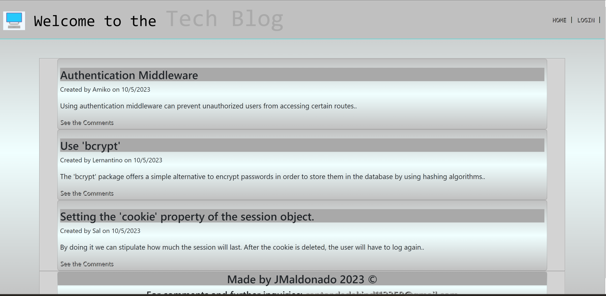

2.Users that are not logged-in can view all of the comments for a particular post, but not comment on them:

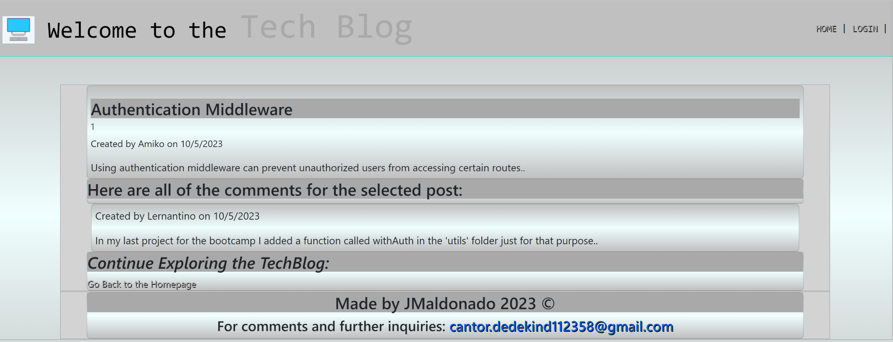

3.If you press the "LOGIN" option in the nav bar, the login form will be rendered. If you try to access with wrong credentials, an alert message will appear:

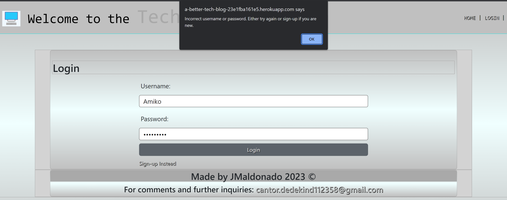

4.If both the username and the password are validated, the blogger will enter his/her dashboard:

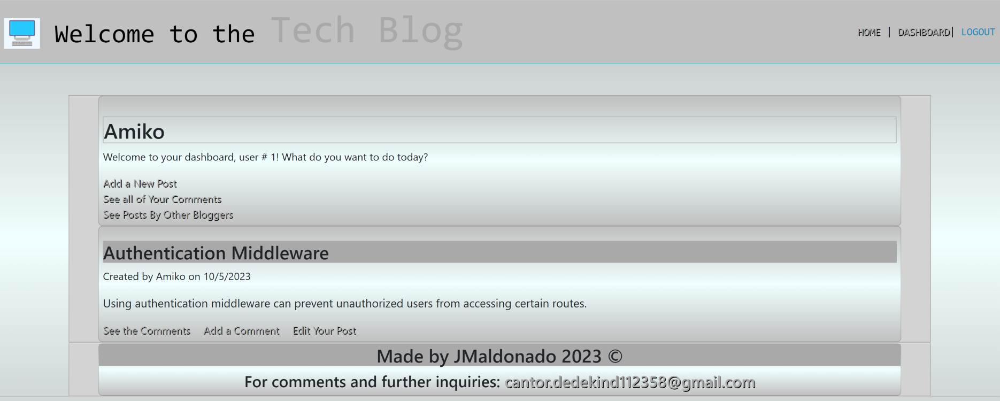

5.The blogger can see all the comments for any of his/her posts:

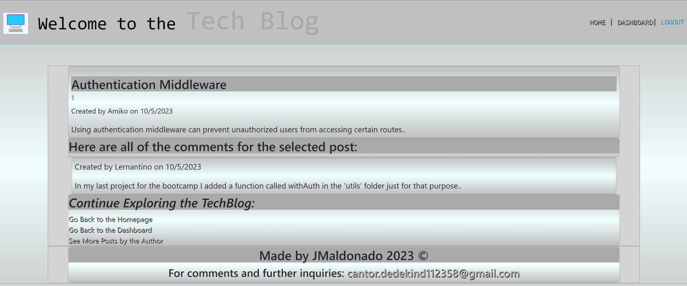

6.By selecting the "Edit Your Post" option, the blogger can either delete or update one post:

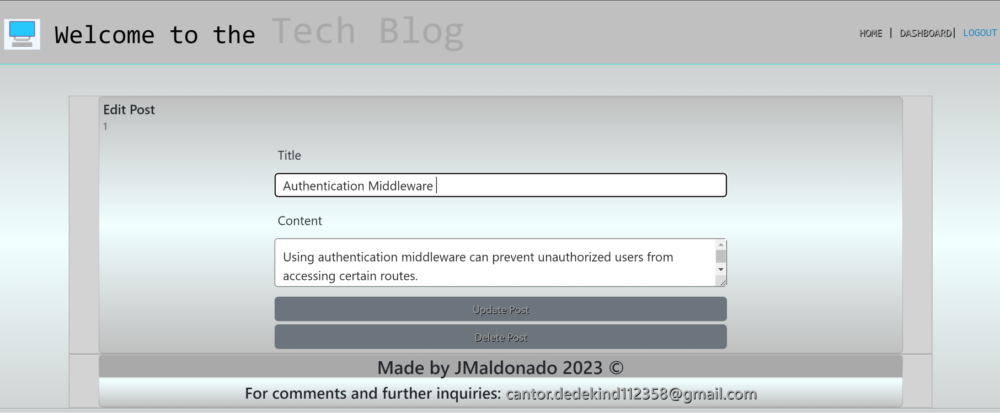

7.After redirecting to the dashboard landing page, the updated post is rendered:

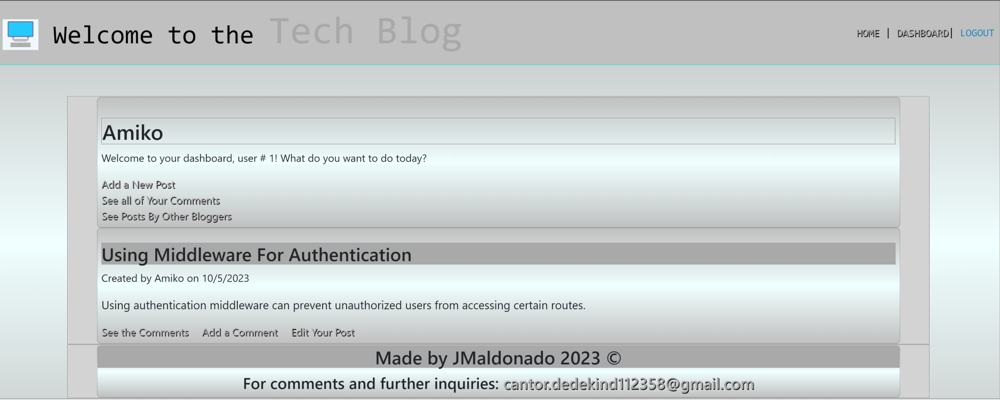

8.By pressing the delete button on the edit-post form, the note will be deleted and will not be shown once redirected:

9.The user can also add a new post. Here is the add-post form:

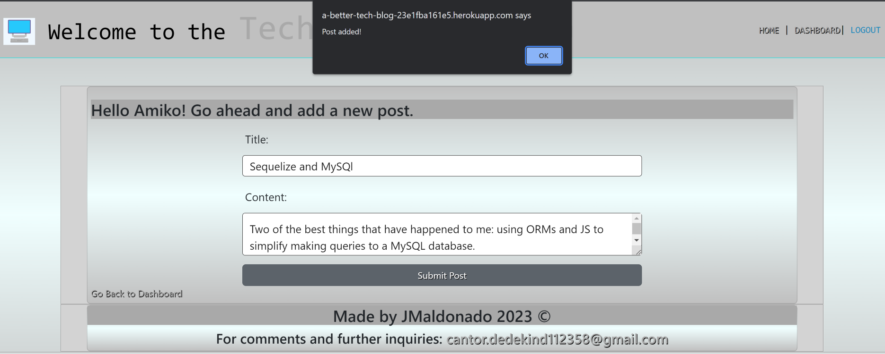

10.Afterwards, the newly created post is shown with a message indicating that nobody has commented on it yet:

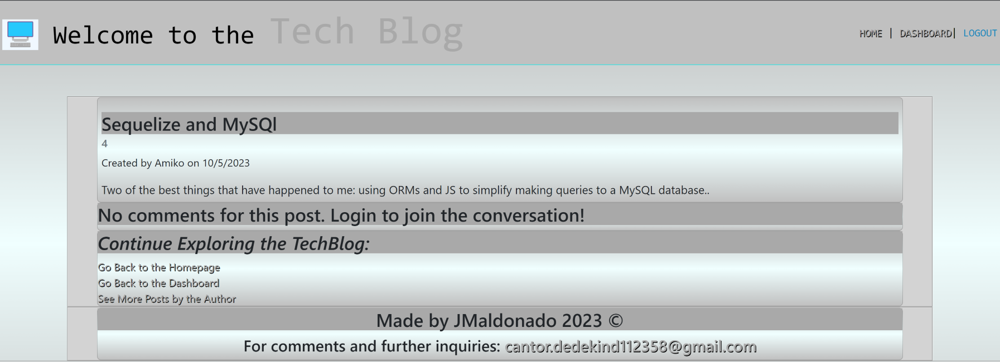

11.It is possible for a blogger to comment even on their own posts:

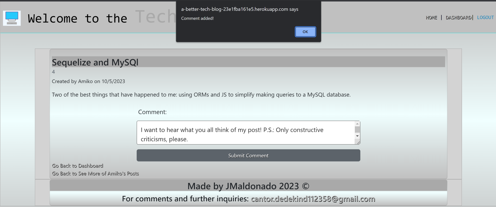

12.After selecting the option to see all of his/her own comments, the following will be rendered:

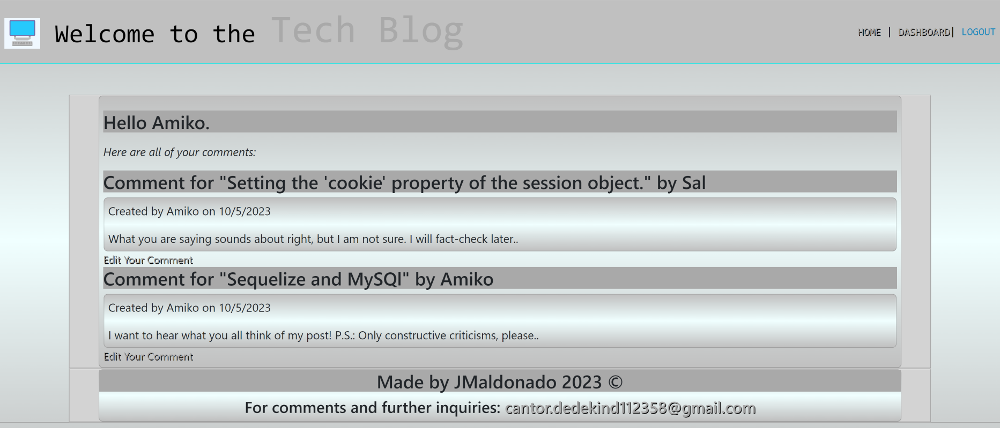

13.A blogger can also edit each one of his or her own comments. Here is the view of the edit-comment form:

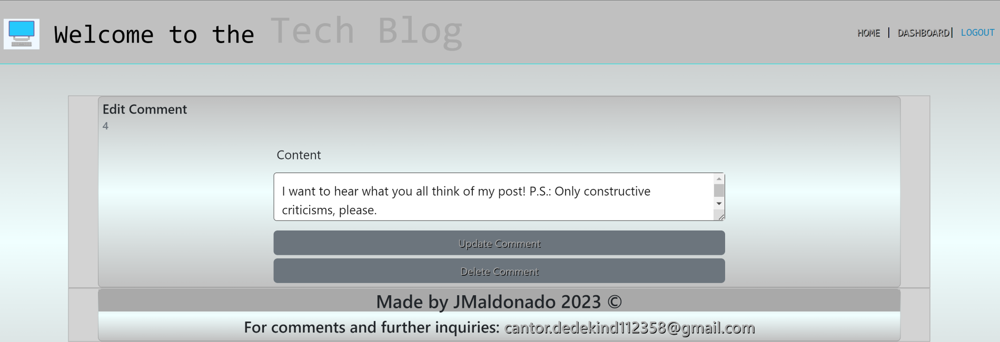

14.If a user has not written any comments or has deleted all of them, this will be rendered when looking for all of his/her own comments:

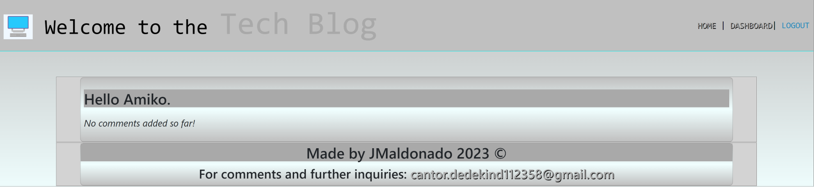

15.The dashboard has the option of listing all current bloggers with links to all of their posts (just press the username text):

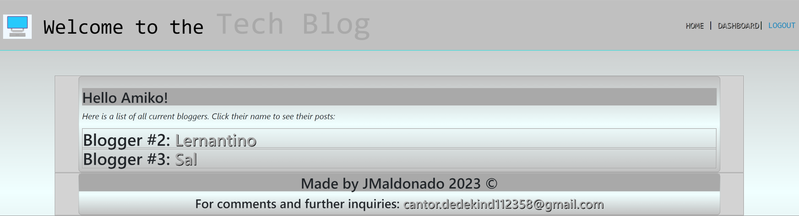

16.Here is the view offered when you select a blogger from the previous list:

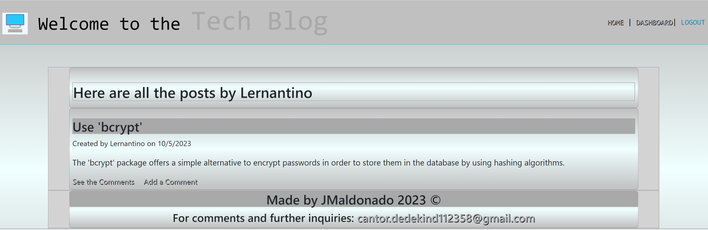

17.If a logged-in user navigates to the homepage, he/she will have the option to add a comment to any post:

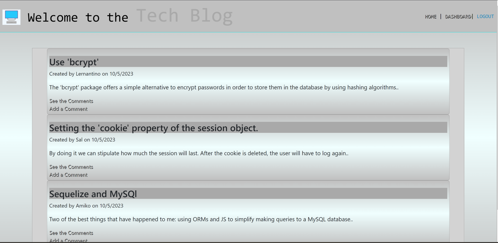

18.For new users, there is the option of signing up:

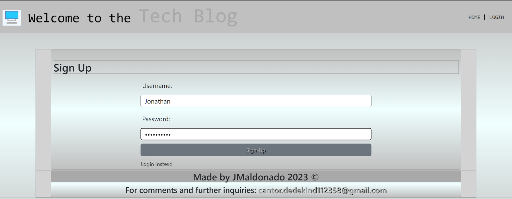

19.Dashboard view for the newly added blogger:

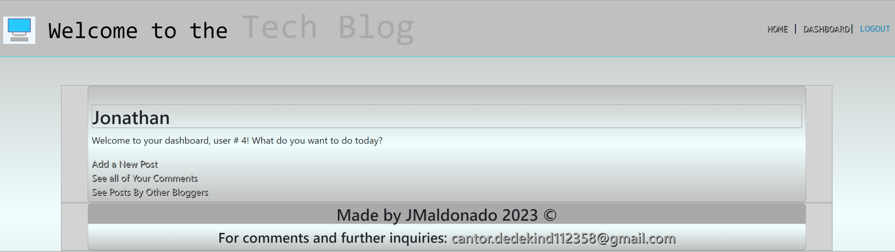

20.If you try to access any endpoint for wich there is no route, a custom 404 page gets rendered:

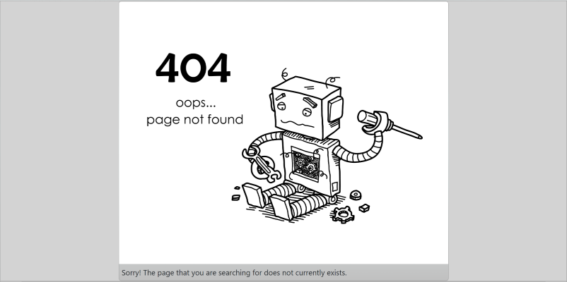

Due to the presence of middleware for serving static files, the user will be able to access the CSS code files and the client-side scripts inside the 'public' folder. Here is one of the client-side script files:

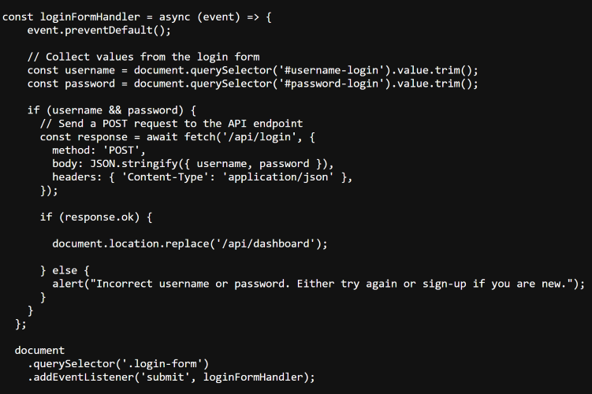

## Credits

The project is of the authorship of Jonathan Maldonado.The GitHub repo can be found at: <https://github.com/jguemarez/NoteTakerApp> .

The app is deployed on Heroku at: <https://web-note-taker-b639757599ce.herokuapp.com/>.

The .gitignore file was lifted from the GitLab class repo found at: <https://git.bootcampcontent.com>.

The front-end part employs the Bootstrap CSS framework. A minimized version of its library and of the scripts it uses can be found below:

1. CSS library: <https://cdn.jsdelivr.net/npm/bootstrap@5.2.3/dist/css/bootstrap.min.css>

2. Associated scripts: <https://cdn.jsdelivr.net/npm/bootstrap@5.2.3/dist/js/bootstrap.min.js>

The folder structure of the project and the helper functions and custom middleware found in the "utils" has been adapted from those found in the activities and Mini-Project for the Module 14 of the Rutgers Full Stack Bootcamp.

This app works in the Node.js JavaScript runtime environment. The latest stable (recommended version) can be found at: <https://nodejs.org/en/download>

We use npm for the specification (semantic versioning) of the app's dependencies and their installation. Here is the URL for the official site of the npm registry: <https://www.npmjs.com>
Here are the dependencies for the development and production environments that we added, including links to find their most recent versions:

Dev-dependencies:

1. Nodemon: "^2.0.3". Used to continuously track the changes to the .js and .json file while coding and debugging, so as not to have to manually stop and restart the express server from listening at the designated port after each change.
<https://www.npmjs.com/package/nodemon>

Dependencies:

1. Express: "^4.17.1". In order to create and work with servers, middleware, routers, etc.
<https://www.npmjs.com/package/express>

2. DotEnv: "^8.2.0". Employed so that we can configure our connections to the database without hardcoding sensititive information that could get compromised by storing the data in environmental variables.
<https://www.npmjs.com/package/dotenv>

3. MySQL2: "^2.1.0". Used to create a connection to and make queries to the database without having to log to the MySQL shell and enter the queries through its CLI, but instead using scripts in JS files.
<https://www.npmjs.com/package/mysql2>

4. Sequelize:"^5.21.7". ORM (Object Relational Mapping) package that synchronizes JS (ES6 specification) classes to the database in order to perform CRUD operations in said database and establish associations(realations) between tables using scripts instead of SQL commands (unless we deem convenient or necessary to use literals).
<https://www.npmjs.com/package/sequelize>

5. Bcrypt: "^5.0.0". We use two methods from this package: bcrypt.hash employs a salting-and-hashing algorithm to encrypt new passwords added to the db during sign-up and bcrypt.compareSync to authenticate the password input for a username that appears in one of the db's records.
<https://www.npmjs.com/package/bcrypt>

6. Express-Session: "^1.17.1". Allows us to save and destroy login sessions by particular users meeting the authorization criteria. It offers many options in terms of cookie settings and allowed protocols, etc.
<https://www.npmjs.com/package/express-session>

7. Connect-Session-Sequelize: "^7.0.4". Facilitates linking the sequelize models to the current login session in order to perform CRUD operations on the db through ORMs while the session lasts. Allows the creation of a Sequelize store.
<https://www.npmjs.com/package/connect-session-sequelize>

8. Express-Handlebars: "^5.2.0". A package that simplifies setting and using the Handlebars template engine while also using an Express server and routers to create RESTful routes.
<https://www.npmjs.com/package/express-handlebars>

## How to Contribute

If you want to contribute, feel free to fork the repo, modify the repo on your local machine and then open a pull request. That way I can review the changes before deciding whther to merge them in the codebase or not.

## Tests

The app was manually tested multiple times before deployment by its author, checking for errors both in the browser's (Google Chrome DevTools for the front end) console and in the terminal (Git Bash for the back end). Before connecting the back-end to the front-end, some endpoints were tested using Insomnia 2023.5.17 as a client.

However, the user should keep an eye for any error thrown in the console and, if possible, open an issue in the GitHub repo detailing the bug. In the future, it would be interesting to devise some tests using a node package like JEST (documentation available at: <https://jestjs.io/docs>.)

## Questions

My GitHub username is "jguemarez" and you can checkout my profile at: <https://www.github.com/jguemarez>.
For further questions and comments, you can mail them to the following address: <cantor.dedekind112358@gmail.com>.

## License

This is an open-source project under the terms of agreement provided by the MIT license.
For more information, click on the following link: <https://opensource.org/license/mit>
